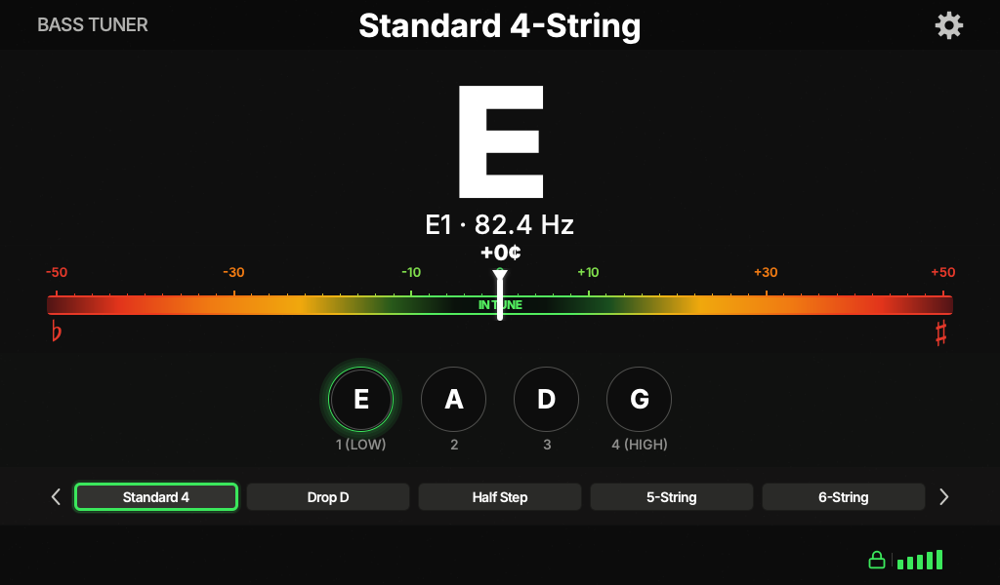
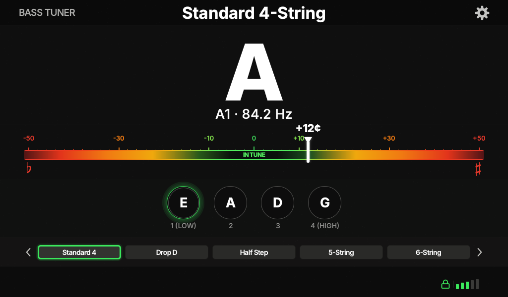
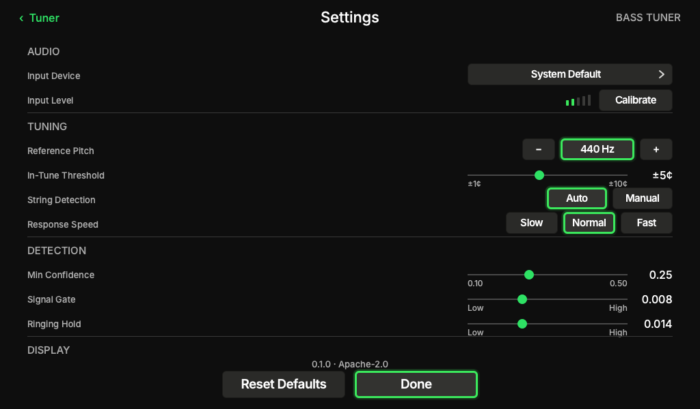

# Bass Tuner

Touchscreen-friendly bass guitar tuner with a terminal CLI and a Qt Quick UI.

**License:** [Apache License 2.0](LICENSE) — see also [NOTICE](NOTICE) and [THIRD_PARTY.md](THIRD_PARTY.md).

## Table of contents

- [Features](#features)
- [Requirements](#requirements)
- [Tutorial](#tutorial)
  - [1. Get the source](#1-get-the-source)
  - [2. Create a virtual environment](#2-create-a-virtual-environment)
  - [3. Install dependencies](#3-install-dependencies)
  - [4. Run the test suite](#4-run-the-test-suite)
  - [5. List audio input devices](#5-list-audio-input-devices)
  - [6. Try the UI without a microphone](#6-try-the-ui-without-a-microphone)
  - [7. Run the CLI tuner](#7-run-the-cli-tuner)
  - [8. Run the touchscreen UI](#8-run-the-touchscreen-ui)
- [Screenshots](#screenshots)
- [CLI reference](#cli-reference)
- [UI controls](#ui-controls)
- [Settings file](#settings-file)
- [Tuning presets](#tuning-presets)
- [Raspberry Pi OS](#raspberry-pi-os)
- [Project layout](#project-layout)
- [Regenerating README screenshots](#regenerating-readme-screenshots)


## Features

- **CLI tuner** — live note, frequency, cents, and lock status in the terminal
- **Qt Quick UI** — fixed 1024×600 layout for small touchscreens (e.g. Raspberry Pi displays)
- **NumPy YIN pitch detection**
- **Built-in presets** — Standard 4, Drop D, half-step down, 5-string, 6-string
- **Persistent settings** — A4 reference, in-tune threshold, input device, detection gates, and more


## Requirements

- Python **3.11+**
- Microphone or audio interface (for live tuning; not needed for `--ui-demo` or unit tests)
- Dependencies in `[requirements.txt](requirements.txt)`: `numpy`, `sounddevice`, `PySide6-Essentials`


## Tutorial

The commands below assume **zsh** on macOS or Linux. Paths use `~` for your home directory.

### 1. Get the source

```zsh
cd ~/src
git clone https://github.com/hbarupon2/Bass-Tuner.git
cd Bass-Tuner
```

Expected output:

```text
Cloning into 'Bass-Tuner'...
remote: Enumerating objects: 49, done.
remote: Counting objects: 100% (49/49), done.
remote: Compressing objects: 100% (42/42), done.
remote: Total 49 (delta 5), reused 49 (delta 5), pack-reused 0
Receiving objects: 100% (49/49), done.
Resolving deltas: 100% (5/5), done.
```

Your prompt should now show the project directory:

```text
~/src/Bass-Tuner %
```


### 2. Create a virtual environment

```zsh
python3 -m venv .venv
source .venv/bin/activate
```

Expected output (no errors; prompt gains a venv prefix):

```text
(.venv) ~/src/Bass-Tuner %
```

Check Python version:

```zsh
python --version
```

Expected output:

```text
Python 3.11.9
```

(Any **3.11+** version is fine.)

### 3. Install dependencies

```zsh
pip install -r requirements.txt
```

Expected output (truncated):

```text
Collecting sounddevice>=0.4.6 (from -r requirements.txt (line 1))
  Downloading sounddevice-0.5.1-py3-none-any.whl.metadata (1.6 kB)
Collecting numpy>=1.26.0 (from -r requirements.txt (line 2))
  Downloading numpy-2.2.4-cp311-cp311-macosx_14_0_arm64.whl.metadata (62 kB)
Collecting PySide6-Essentials>=6.6.0 (from -r requirements.txt (line 3))
  Downloading PySide6_Essentials-6.9.0-cp39-abi3-macosx_13_0_universal2.whl.metadata (3.6 kB)
...
Successfully installed PySide6-Essentials-6.9.0 numpy-2.2.4 shiboken6-6.9.0 sounddevice-0.5.1
```


### 4. Run the test suite

From the project root (`~/src/Bass-Tuner`):

```zsh
python -m unittest discover -s tests -v
```

Expected output (last lines):

```text
test_roundtrip (test_user_settings.UserSettingsTest.test_roundtrip) ... ok
test_slider_roundtrip_in_tune (test_user_settings.UserSettingsTest.test_slider_roundtrip_in_tune) ... ok
test_unknown_keys_ignored (test_user_settings.UserSettingsTest.test_unknown_keys_ignored) ... ok

----------------------------------------------------------------------
Ran 56 tests in 0.4s

OK
```


### 5. List audio input devices

```zsh
python main.py --list-devices
```

Expected output (device names vary by machine; `>` marks the current default):

```text
  0 USB Audio CODEC, Core Audio (1 in, 0 out)
  1 Built-in Microphone, Core Audio (1 in, 0 out)
> 2 Scarlett Solo USB, Core Audio (2 in, 2 out)
  3 Built-in Output, Core Audio (0 in, 2 out)
```

Note the **index** of your bass input (column at the start of each line). Use that number with `--device` below.

### 6. Try the UI without a microphone

Useful for checking that Qt and the UI load correctly:

```zsh
python main.py --ui-demo
```

A **1024×600** window opens with synthetic pitch data animating the needle. No audio device is required.

Press **Escape** or close the window to quit.

### 7. Run the CLI tuner

Replace `2` with your input device index from step 5:

```zsh
python main.py --device 2
```

Expected startup lines:

```text
Preset: Standard 4  |  strings: E1 A1 D2 G2
Keys: 1-6 string  0 auto  [ ] preset  Ctrl+C quit
Listening…
```

While you play, one line updates in place (example — values change live):

```text
Standard 4       auto  E1   82.4 Hz    +2c  [OK]  conf=0.85
```


| Column    | Meaning                            |
| --------- | ---------------------------------- |
| `E1`      | Locked target note                 |
| `82.4 Hz` | Detected frequency                 |
| `+2c`     | Cents sharp (− = flat)             |
| `[OK]`    | In tune · `[..]` = still adjusting |
| `conf`    | Pitch confidence (0–1)             |


**Keyboard shortcuts** while the CLI is running:


| Key       | Action                    |
| --------- | ------------------------- |
| `1`–`6`   | Force string (1 = lowest) |
| `0`       | Auto string detection     |
| `[` / `]` | Previous / next preset    |
| `Ctrl+C`  | Quit                      |


Example after pressing `3` (D string on a 4-string bass):

```text
String 3 (D2)
strings: E1 A1 D2 G2
```


### 8. Run the touchscreen UI

```zsh
python main.py --ui --device 2
```

Same device index as the CLI. Opens the full tuner UI at **1024×600**. Tap the gear icon for settings, string circles to force a string, or preset chips at the bottom.

Optional preset on launch:

```zsh
python main.py --ui --device 2 --preset drop_d
```


## Screenshots

Main tuner — locked on the low E string, in tune:



Main tuner — listening, slightly sharp:



Settings — input device, reference pitch, detection thresholds:



## CLI reference

```zsh
python main.py --help
```

```text
usage: main.py [-h] [--device DEVICE] [--list-devices] [--preset PRESET]
               [--ui] [--ui-demo]

Bass tuner

options:
  -h, --help       show this help message and exit
  --device DEVICE  sounddevice input index
  --list-devices
  --preset PRESET  preset key from presets.json
  --ui             launch Qt Quick touchscreen UI
  --ui-demo        UI with fake pitch (no audio)
```


| Flag             | Description                                   |
| ---------------- | --------------------------------------------- |
| `--list-devices` | Print PortAudio input/output devices and exit |
| `--device N`     | Input device index from `--list-devices`      |
| `--preset KEY`   | Preset key (default: `standard_4`)            |
| `--ui`           | Launch Qt Quick UI                            |
| `--ui-demo`      | UI with synthetic pitch (no audio)            |


Invalid preset example:

```zsh
python main.py --preset badname
```

```text
Unknown preset 'badname'. Options: standard_4, drop_d, half_step, five_string, six_string
```


## UI controls


| Control                            | Action                                 |
| ---------------------------------- | -------------------------------------- |
| String circles (`E` `A` `D` `G` …) | Force that string                      |
| Preset chips (bottom)              | Switch tuning preset                   |
| `<` / `>` arrows                   | Cycle presets                          |
| Gear icon                          | Open settings                          |
| **Escape**                         | Close settings, or quit from main view |


Keyboard shortcuts (when the UI window is focused): same as CLI — `1`–`6`, `0`, `,` / `.`, arrow keys.

## Tuning presets

Defined in `[config/presets.json](config/presets.json)`:


| Key           | Name           | Strings           |
| ------------- | -------------- | ----------------- |
| `standard_4`  | Standard 4     | E1 A1 D2 G2       |
| `drop_d`      | Drop D         | D1 A1 D2 G2       |
| `half_step`   | Half Step Down | Eb1 Ab1 Db2 Gb2   |
| `five_string` | 5-String       | B0 E1 A1 D2 G2    |
| `six_string`  | 6-String       | B0 E1 A1 D2 G2 C3 |


## Raspberry Pi OS

Install system libraries, then follow the same venv steps from the project root:

```zsh
sudo apt update
sudo apt install python3-venv libportaudio2
cd ~/src/Bass-Tuner
python3 -m venv .venv
source .venv/bin/activate
pip install -r requirements.txt
python main.py --list-devices
python main.py --ui --device 0
```

On a Pi with a 1024×600 display, run the UI full-screen from your desktop session or autostart `python main.py --ui --device N`.

## Project layout


| Path                | Role                                      |
| ------------------- | ----------------------------------------- |
| `main.py`           | Entry point (CLI + UI flags)              |
| `cli.py`            | CLI keyboard command handling             |
| `core/`             | Pure tuner logic (no audio/UI imports)    |
| `audio/`            | Microphone capture + NumPy YIN            |
| `config/`           | Built-in presets + user settings helpers  |
| `ui/`               | Qt Quick UI (`qml/`, controller, backend) |
| `tests/`            | Unit tests                                |
| `docs/screenshots/` | README screenshots                        |


